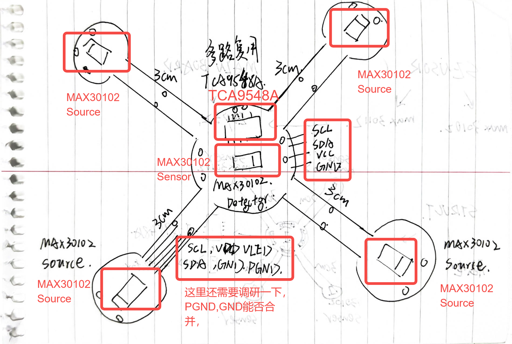
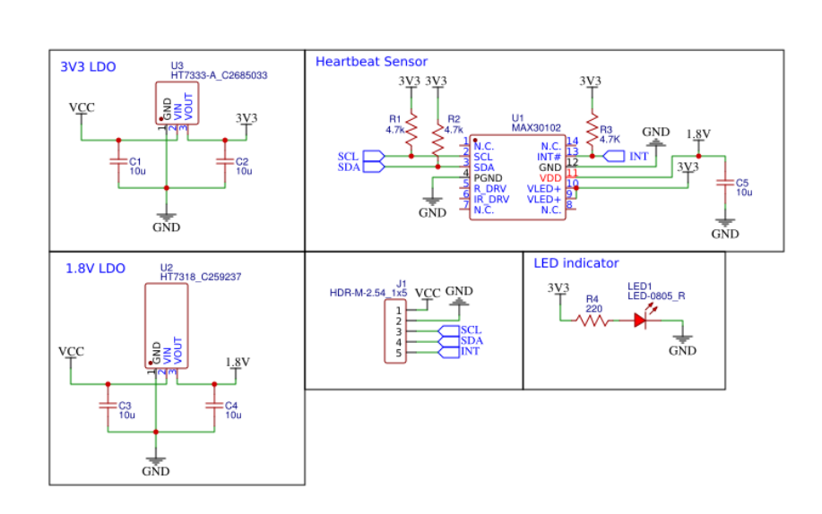
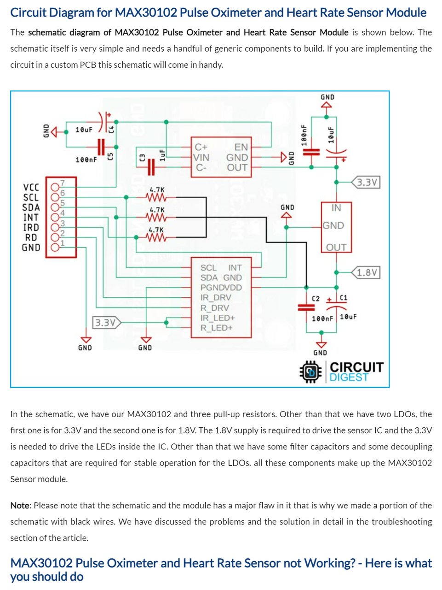
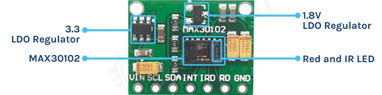
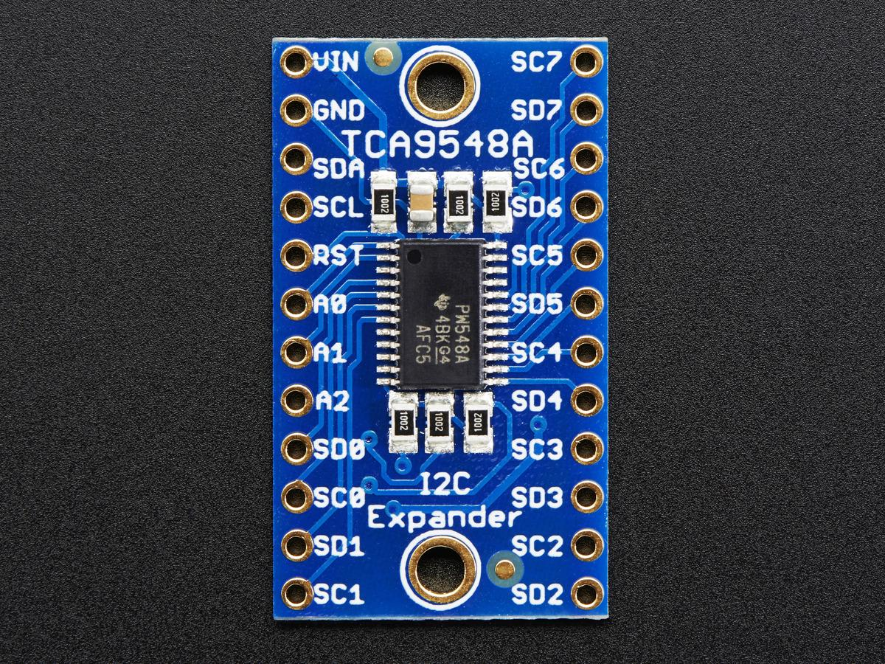
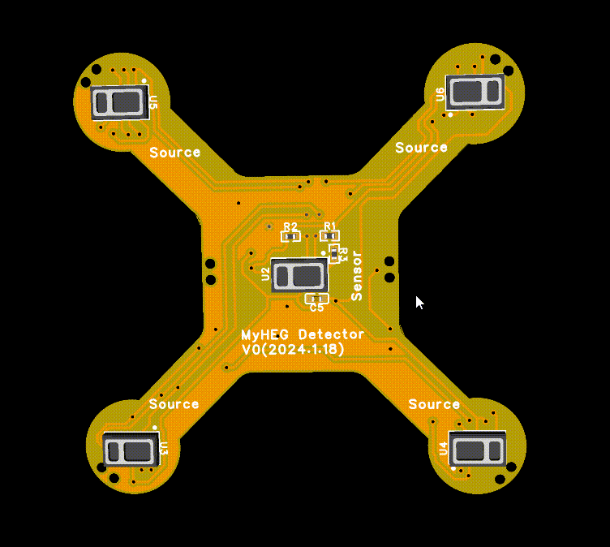

# 设计一下MyHEG(max30102)的detector pcb

## 设计思路：
要参考一下这篇review：https://joi.usst.edu.cn/html/2022/5/20220501.htm

参考这个项目的思路：https://github.com/joshbrew/HEGduino_V0?tab=readme-ov-file#known-issues

利用5个MAX30102芯片来实现一个柔性PCB HEG探头的设计，5个芯片中四个为光源source，处在四个伸出的触手上，上面要打两个小洞，从而好缝，触手上的四个MAX30102作为光源在正常工作中是不需要通信，所以我们只需要在setup阶段对他们进行初始化，这里可以使用到TCA9548 I2C多路的复用器，在setup的时候咱们就选通sources们，设置他们的光源幅值，脉宽等，设置完成以后就不在和他们进行通信了，然后我们再选通处在中心的Sensor，开始检测。

TCA9548编程指南：https://randomnerdtutorials.com/tca9548a-i2c-multiplexer-esp32-esp8266-arduino/
- 参考编程指南，依靠购买的模块简单做一个实现：
https://github.com/yushiran/MyHEG
最终期望达成的设计目标：
1. 集成度高的一个HEG模拟前端，搭配自己写的库，用尽量少的接口（一组I2C接口+VCC,GND，用一个4pin的fpc排线和main board链接）完成Sources+Sensor多个光源和一个传感器的HEG应用场景
2. 可复用性强，预留好很多用来缝线的口，可以缝制在脑电帽中，一个PCB负责一个区域的血氧监控
3. Source+Sensor均可调节，每个Source单独具有一个I2C通道，在setup阶段可以实现自定义赋值，脉宽
4. 成本较低：5*MAX30102(淘宝单价在5-12元，所以最便宜5个为25元，贵的话为60元)，TCA9548（2元），FPC制版（5个约200元，合一个40元），接插件+贴片电阻电容+电源管理芯片（预估为5元），所以成本控制最好的情况下一个模块价格为72元，最差的情况大概为107元。

## PCB设计情况
